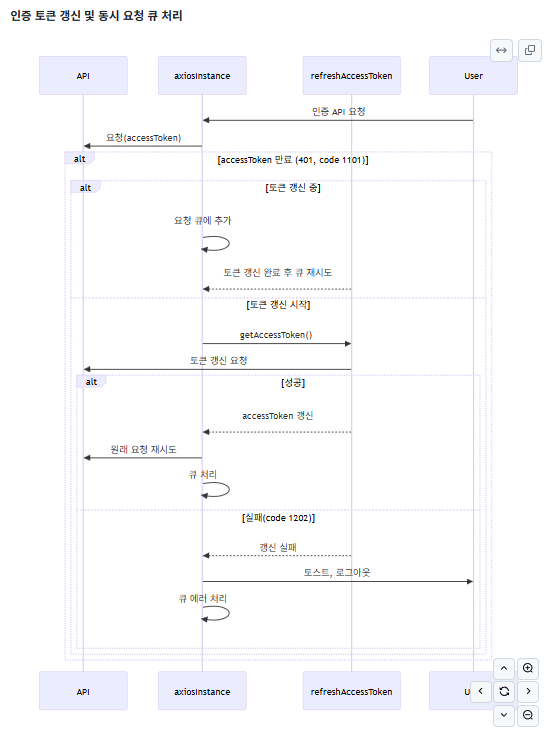

# 2안: 사용자 행동 데이터 분석 및 UX 개선 프로젝트 (2주차 진행 현황 - 미래가 어둡다)

## 📌 이번 주 진행 내용

### ✅ UI / UX 개선 요소 확인 중

- 생각보다 개선할 곳과 개선 방향 느낌 오는 곳이 없다

### 일단 경험치가 중요할 것 같다!

- 테크 블로그에서 UX 관련 글들 열심히 읽는 중 (브런치 UX 글, 각종 테크 회사 블로그 디자인 관련 글 읽는 중)
- UX 관련 글 모아놓은 곳
  - 브런치: https://brunch.co.kr/keyword/UX
  - 토스: https://toss.tech/design
  - 여기어때: https://techblog.gccompany.co.kr/tagged/ux

# 3안 - AI를 통한 바이브 코딩 프로젝트 (2주차 진행 현황)

## 📌 이번 주 진행 내용

### ✅ Cursor 도입

**Cursor**는 AI 기반의 코드 에디터로, 개발자가 코드를 작성할 때 AI가 실시간으로 코드를 분석하고 효율적인 코딩을 돕는 도구입니다.

### ✅ CodeRabbitAI 유료화 도입

**CodeRabbitAI**는 자동화된 코드 리뷰 서비스를 제공하는 AI 기반 도구로, 품질 향상과 버그 예방에 효과적입니다. 이번 주차에 유료 버전으로 전환하여 더욱 고급화된 코드 리뷰 기능을 도입하였습니다.

### ✅ MCP(Model Context Provider) 환경 구축

\*\*MCP(Model Context Provider)\*\*는 작업이나 프로젝트의 맥락을 관리하여 AI 도구가 맥락에 맞는 효과적인 지원을 제공할 수 있도록 돕는 시스템입니다. 이번 주에는 Jira와 Figma를 MCP와 연동하여 작업 효율성을 극대화했습니다.

---

## 📸 진행상황 공유 설명

### 1. CoderabbitAI 도입

- Code Rabbit AI 를 통한 github PR 자동화
  - Git PR summary 자동 작성
  - 수정 사항에 대한 워크 쓰루 및 개선점, 문제 사항 체크

### 2. cursor 를 통한 커밋 메시지 자동화

- 단축키 (설정 필요) 딸각 으로 커밋 메시지 자동 생성
- 다시 작성해야할 부분도 있지만, 내가 놓치거나 간단한 commit 메시지라면 자동 작성 가능

### 3. MCP 환경 설정 (Cursor 내 설정화면)

- Jira와 Figma 연동이 완료되어 다양한 작업 관리 및 디자인 연계를 지원합니다.

### 4. MCP 를 통한 jira 환경 업데이트

- #### MCP를 통한 Jira task 관리 화면

  - 

  - MCP를 통해 현재 자신에게 할당된 Jira 작업 목록을 쉽게 확인할 수 있습니다.

- #### MCP를 이용한 Jira task 상태 변경 및 코멘트 추가 과정

  - 

  - AI를 활용하여 Jira의 task 상태를 변경하고 관련 코멘트를 자동으로 추가할 수 있습니다.

- #### MCP를 통한 Jira workflow 상태 변경 결과

  - 

  - AI가 작업 상태를 workflow에 따라 적절히 변경했는지 확인할 수 있습니다.
  - 하지만, 이 과정에서 jira 상태 변경이 실패 했습니다.

- #### Jira 최종 상태 변경 완료 화면

  - 

  - AI 에게 현재 project 의 jira workflow 를 알려주고, 해당 workflow 대로 상태를 변경해달라고 맥락을 전달했습니다.
  - 그리고 Jira의 task 상태가 정상적으로 "완료"로 변경되고 코멘트까지 자동으로 입력된 결과 화면입니다.

- #### Jira 내 개별 task 코멘트 및 기록 화면

  - 
  - 

  - 각 Jira task에 자동으로 기록된 상태 변경 이력 및 코멘트 기록을 볼 수 있습니다.

### 5. MCP를 활용한 Figma 연동 과정 및 결과

- MCP를 통해 Figma 디자인 데이터를 직접 가져와 코드로 변환하여 구현을 진행한 과정과 결과입니다.
- 기존 Figma Plugin 이나 AI 프롬포트를 통한 디자인 보다는 훨씬 유사한 디자인으로 코드를 구현 함
- 코드도 수정하기 아주 힘든 정도는 아니지만, 아예 처음부터 만드는 것 vs 이걸 수정하는 것 중에 비교한다면 현재로선 후자가 더 효율적이라 생각됨
- Figma Layer 마다 되었으면 더 디테일하게 코드를 작성할 수 있었지만, 아쉽게도 해당 MCP 는 무조건 전체를 바탕으로 코드로 구현

---

이 내용을 기반으로 AI 기반 생산성 향상 프로세스를 지속적으로 개선하고 확장할 예정입니다.
