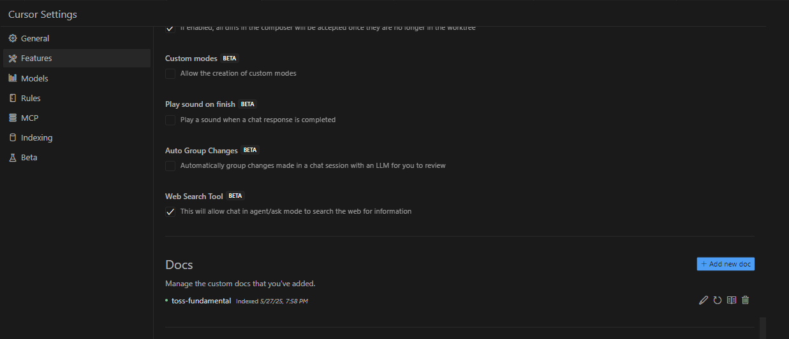
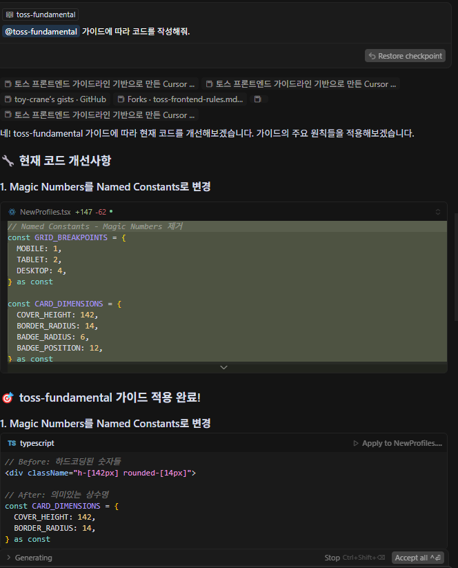
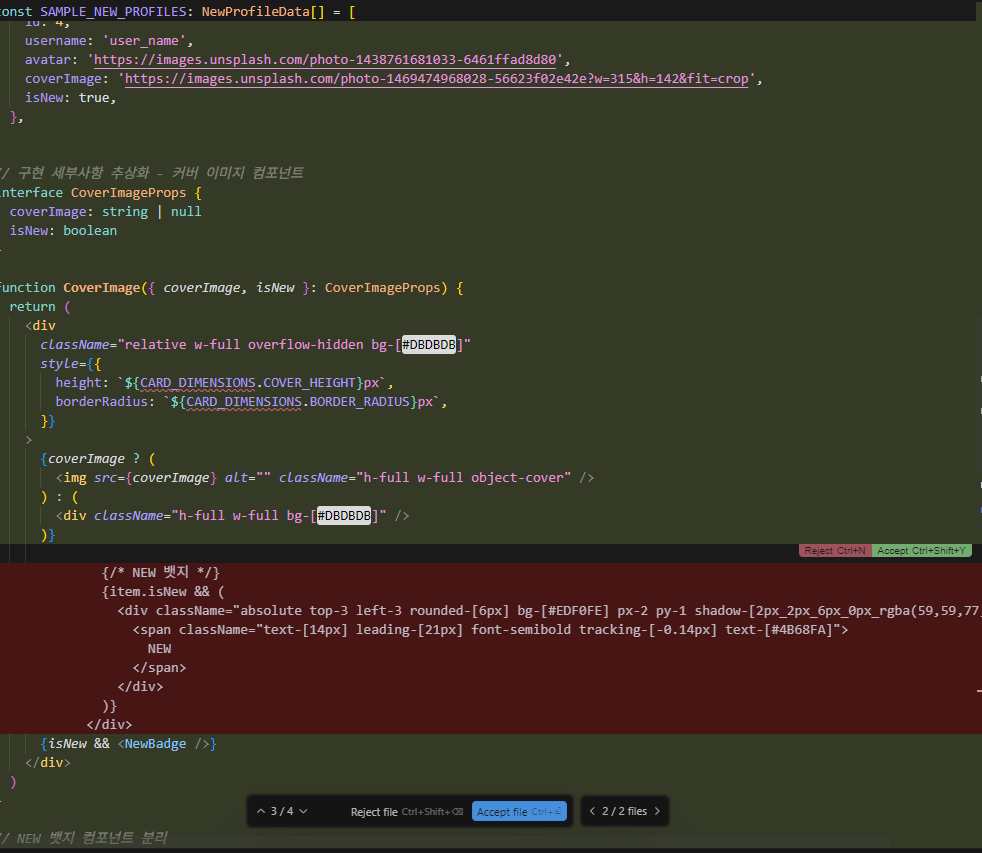

# 2안: 사용자 행동 데이터 분석 및 UX 개선 프로젝트 (3주차 진행 현황 - 미래가 어둡다)

## 📌 이번 주 진행 내용

### ✅ UI / UX 개선 요소 확인 중

- 생각보다 개선할 곳과 개선 방향 느낌 오는 곳이 없다

### 일단 경험치가 중요할 것 같다!

- 테크 블로그에서 UX 관련 글들 열심히 읽는 중 (브런치 UX 글, 각종 테크 회사 블로그 디자인 관련 글 읽는 중)
- UX 관련 글 모아놓은 곳
  - 브런치: https://brunch.co.kr/keyword/UX
  - 토스: https://toss.tech/design
  - 여기어때: https://techblog.gccompany.co.kr/tagged/ux

### 좋았던 글 소개

- UX 라이팅 / 문구 관련된 것
  - https://toss.im/simplicity/sessions/the-end-of-ux-writers
  - 토스는 AI 를 통해 (RAG) 좋은 문구를 학습시키고, 다크 패턴을 줄이기 위해 노력했다.
    - "혜택은 구체적인 숫자로 표현하기, 하단 문구는 글자 수 기준을 넘기지 않기️ 같은 규칙들을 정의했죠."
  - https://brunch.co.kr/@1dayliterature/728
    - 단어의 미묘한 차이가 사용자의 의도와 시스템 반응을 유도한다.

# 3안 - AI를 통한 바이브 코딩 프로젝트 (3주차 진행 현황)

## 📌 이번 주 진행 내용

toss FE 가이드 문서, MCP 적용

- https://frontend-fundamentals.com/code-quality/
- https://gist.github.com/toy-crane/dde6258997519d954063a536fc72d055

---

## 📸 진행상황 공유 설명

### toss FE 가이드 문서, MCP 적용

- 
- 
- 
- 내가 직접 룰을 커스텀하면서 나에 맞게 쓰도록 해야할 것 같다
- 하지만 이 비용을 사용하는 게 맞을까.
- 현재는 빠르게 개발을 기간 내에 완료 해야 하는 상황이라, 일단은 조금 써 보면서 수정하면서 쓸 지, 도입을 미룰 지 고민해 봐야겠다.

---

이 내용을 기반으로 AI 기반 생산성 향상 프로세스를 지속적으로 개선하고 확장할 예정입니다.
